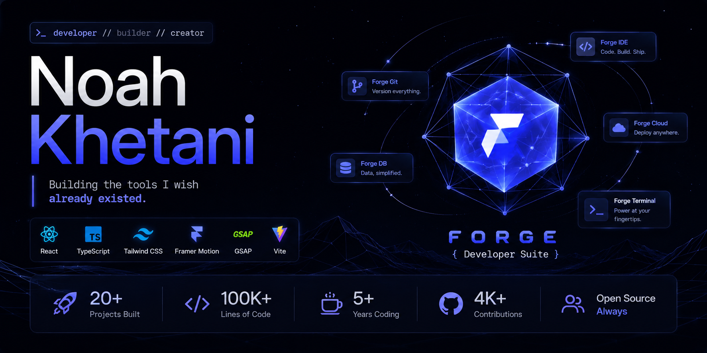

  

<h1 align="center">Noah Khetani</h1>

  <b>building the tools i wish already existed.</b> 
  forge • ember • systems • ai • dev tools

  
  
  

---

## about

i build software from the ground up - low-level systems code, backends, dev
tools, ai apps. most of my projects start with the same question:

> why doesn't this exist yet?

and then i go build it.

## what i'm working on

**forge** - an ai-first ide meant to actually compete with modern editors.
ai-assisted coding, multi-model workflows, workspace intelligence, an extensible
architecture, and a clean dev experience.

**ember** - a lighter ide focused on speed, simplicity and low resource use.
fast startup, minimal overhead, clean ui, responsive editing, gets out of ur way.

## stack

<table>
  <tr>
    <td><b>Systems</b></td>
    <td>
      
      
      
      
    </td>
  </tr>
  <tr>
    <td><b>Backend</b></td>
    <td>
      
      
      
    </td>
  </tr>
  <tr>
    <td><b>Frontend</b></td>
    <td>
      
      
      
      
    </td>
  </tr>
  <tr>
    <td><b>Mobile</b></td>
    <td>
      
    </td>
  </tr>
</table>

---

## github stats

  

  

  

---

## stuff i'm into

dev tools, programming languages, operating systems, ai, distributed systems,
performance work, software architecture.

## how i think about it

good software should be fast, understandable, useful and well designed. the
complexity belongs in the implementation, not in the ux.
